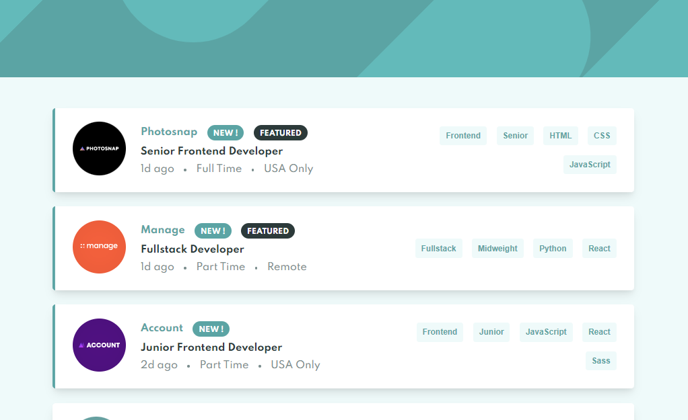
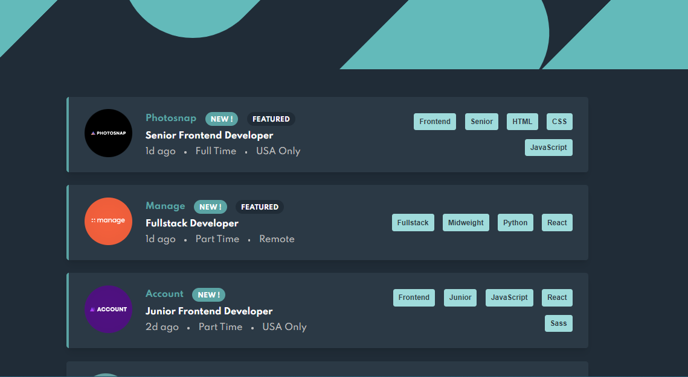

# STATIC JOB LISTINGS MASTER

## This project is based on one of the [Frontend Mentor](https://www.frontendmentor.io/) challenges.




### [Job listings with filtering](https://www.frontendmentor.io/challenges/job-listings-with-filtering-ivstIPCt)

# Dark and Light mode

- Application changes dark or light mode depending on the mode your operating sistem is in.

# Technologies used

- Vue + Pina + Ts
- Sass

## Instalation

- It is important to have installed node

### Instalation modules

```
npm i
```

### Run application

```
npm run dev
```
